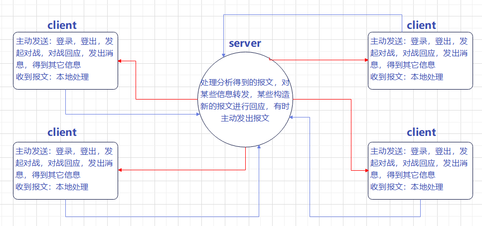

# SSP应用层协议

|  姓名  |   学号    |       邮箱        |
| :----: | :-------: | :---------------: |
| 吕玉龙 | 191220076 | 1931015836@qq.com |

SSP协议简介：该协议应用在本次实验实现的一个游戏对战项目中，它可以支持用户登陆，退出，挑战，得到游戏用户信息，发送消息实现用户交互，实时对战，排行榜的需求。这个协议主要的参与者包括客户端以及服务端。

1. 服务端：

   服务端在这个系统中需要对客户发来的报文进行回应，同时也需要对某些特定的报文进行转发，还需要针对某些报文进行特定的信息处理。它同时具有主动发出报文的能力，以满足需要对客户端进行通知的需求。

2. 客户端

   客户端具有自主发送报文的能力，针对用户不同的需求，发出不同的报文。当然，它也能接收来自服务器的报文，并分析报文中的字节，通知用户，需要做出什么反应。

一个简单的交互示例如下：

假设现在用户需要进行登录，用户输入自己的用户名之后，客户端得知用户想要登录，于是利用SSP协议构造登录报文，并发送给服务器。服务器收到了这个报文之后，利用SSP协议对收到的报文进行解析，解析完毕之后，服务器会得到用户输入的用户名，并进行判断，是否这个用户名已经被注册。如果该用户名已经被注册，那么服务器就会构造一个注册失败的报文发回给客户端。否则，构造一个登录成功的报文发回给客户端。客户端收到这个报文之后，进行解析，如果登录成功，那么进入下一个界面。否则显示登录失败。


### 协议运行图例



该图例中，通信分为红色连接线和蓝色连接线，其实代表着发送和监听，实际上这也标识出实现的时候的线程工作方式。

### 具体SSP协议

下面解释对于具体SSP协议的字节填充方式。

```c
struct Log_Packet_data{
    char kind;//00:login 01:logout 02:get broadcast 03:challenge 04:reply to challenge 05:battle 06:send msg 07: get rank
    char name[12];
    char oppname[12];
    char move;// 1 win 2 2 win 3 3 win 1
    char msg[50];
};
struct Server_Packet_data{
    char kind;//00:get info 01:reply to login 02:broadcast 03:challenge name illegal 04:send challenge request 05:send challenge reply 06:battle result 07 send msg 08 send ranklist
    char log;//(01)01 allow 02 false (02) 01 login 02 log out (03) 01 legal 02 illegal (06)finish or not
    char oppname[12];
    char accept;//(05)01 acc 02 not (06)01 win 02 lose 03 draw
    int num;
    struct User_State userstate[15];
    char msg[50];
    struct Ranklist_ rank[15];
};
```

第一个结构体是客户端进行填充的包。

kind指出这个包的类型，00：登录，01：登出，02：得到玩家的在线信息，03：发起对战，04：对对战的回应，05：对战出招，06：玩家之间的发送消息，07：得到排行榜。

name[12],oppname[12]，分别指出发送这个包的用户名，oppname只有在发起挑战和对对战的回应才会用到，指出对手的用户名

move表示出招，分别代表石头，剪刀，布

msg在用户想进行用户之间的信息交互时才会启用，代表发送的消息

第二个结构体则是服务器端所进行填充的包

kind同样指出这个包的类型，00：对用户想要得到玩家在线信息的回应，01：对登录报文的回应，02：有用户登入或登出的广播，03：用户想挑战的用户是否合法的回应，04：转发挑战请求，05：转发挑战回应，06：进入对战后，对每一次出招判断出结果的回应，07：转发消息，08：发给用户排行榜

log在是用户登录的报文的回应时启用，01表示用户名合法，02不合法；是广播报文时，表示这个用户是登入还是登出；是对用户想挑战的用户是否合法的回应，01挑战用户合法，02不合法；是进入对战后，对每一次出招判断出结果的回应时，表示这场对战是否完结，01完成，02未完成。

oppname在转发报文时启用，填入转发的用户名

accept在转发用户对挑战的回应时启用，01表示接收，02不接受；在进入对战后，对每一次出招判断出结果的回应时，01表示这一轮胜利，02这一轮失败，03平局

num和userstate在用户想要所有玩家在线信息时启用，num表示总共的玩家数，userstate是一个结构体用来指出玩家的名字以及状态。状态有三种（在线，对战中，请求对战中）

msg转发用户之间消息时启用，代表消息

rank则是排行榜信息，只有用户请求排行榜信息时才会启用


##### PS：设计思路基本上和实验三的报文填充方式相同，当然这里对包的某些字节使用了复用，原因的话，其实就是想把包构造的稍微小一些，避免过大的单个结构体，msg的长度限制在50，用户名长度设计小于12都是这个原因
